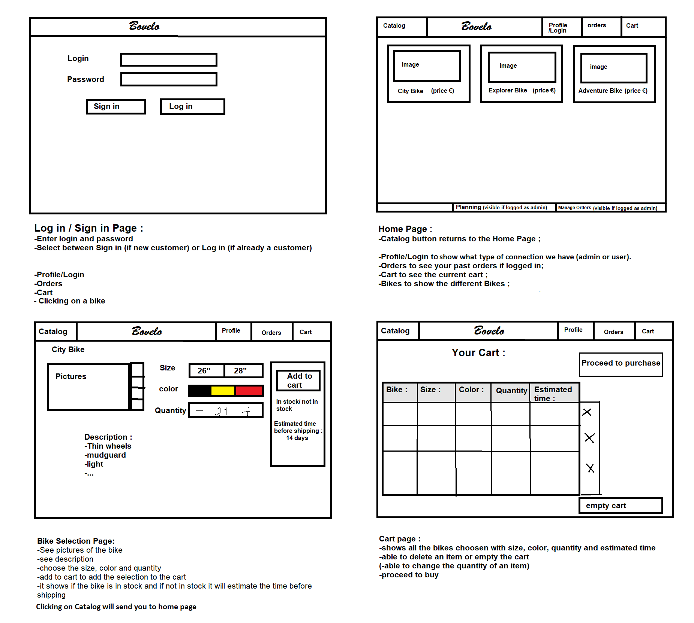

# **Bovelo-project-group-4**  

Software engineering 2 project

## **1. Classes :**  

The classes in this project are :

- *User :*  
The user can be a representative or an admin. The representative can see the catalog, configure a bike, add to cart and pass orders. The admin is able to do the same and is able to see its planning, the components needed to assemble a bike (and the location of the parts) and manage orders.

- *Catalog :*  
The catalog is a class that shows all the different types of bikes (City Bike, Explorer Bike and Adventure Bike).

- *BikePart :*  
It's regrouping every part needed to build a Bike. It also contains the location of each part, the quantity in stock and the time to assemble it.

- *Bike :*  
A bike is built with multiple BikePart's. It contains a type, a total price and can be configured with a size and color.

- *OrderBike :*  
A class to create orders of bikes. A user may have multiple OrderBike’s. An OrderBike has at least 1 Bike in it. 

- *OrderBikePart :*  
A class to create orders of bikePart, it’s the stock management that can order (or “addToCart()”?) and the admins will verify and pass the order.

- *Planning :*  
A class that takes all the OrderBike objects every week to create a planning, depending on the number of admins, when the order was passed and the stock of bike parts.

- *StockManagement :*  
A class that takes all the OrderBike objects every week and will check the stock and order BikeParts if needed. 

- *IupdatableComponent :*  
An interface that updates the classes it's implemented in.

## **2. Diagrams, links and schematics :**  

### **2.1. Diagrams :**  
- *Class Diagram :* https://app.creately.com/diagram/ET0DnpMZXqP/edit
- *Use cases Diagram :* https://lucid.app/lucidchart/a3912014-fae6-4ac3-ad07-5af240573b45/edit?beaconFlowId=0FBAD1001AD03DB9&page=0_0#?folder_id=home&browser=icon
- *User activity Diagram :* https://drive.google.com/file/d/1Gk_sozGZPf4hDu128_76lsnuZxIa-klZ/view  

### **2.2. Links :**  
- *Design brief :* https://claco.ecam.be/apiv2/resource_file79568/raw
- *Azure Devops :* https://dev.azure.com/ECAM3BE/Groupe4  

### **2.3. Schematics :**  
- *Interface mockup :*  
- *Mockup iteration 1 :* https://app.diagrams.net/#G1E008b_3q2edldHUvpJ3NwuaSqwDhu-G8
- *Mockup iteration 2 :* https://app.diagrams.net/#G1Z4jrSf73k9zW0ssS0kXVY-IMI5MD1hKv

## **3. User stories :**

###  **3.1 Iteration 1 :**  

- As a representative, I want to be able to login to access my account.  
- As a representative, I want to see the list of products on the homepage of the app in order to present it to the bicycle shop.
- As a representative, I want to click on a product to get its details.
- As a representative, I want to choose the color, quantity and size on a product to add it in the cart.
- As a representative, I want to know the price of a product to show it to the bicycle shop.
- As a representative, I want to be able to add, delete, or see a product in my cart to pass the order.
- As a representative, I want to validate, cancel my cart to manage my cart.
- As a representative, I would like to receive a summary of my order in order to be able to receive the information to collect it.

###  **3.2 Iteration 2 :**  

- As a production manager, I want to be able to see all the orders to make a production planning.
- As an assembler, I want to see the production planning in order to know what I have to do for the week.
- As an assembler, I want to have access to the available bike parts in order to assemble the bikes.
- As a representative, I want to receive an estimated delivery time in order to inform the bicycle shop when the order will be ready.

## **4. Old links :**  

- *First Diagrams [old] :* https://lucid.app/lucidchart/2d7e6938-bb10-4799-b251-3f24b5d9584f/edit?page=0_0#?folder_id=home&browser=icon  
- *First Class Diagram [old] :* https://app.creately.com/diagram/KlDGg7FOAVr/edit
- *Second Class Diagram [old] :* https://app.creately.com/diagram/V171HVeEYau/edit

